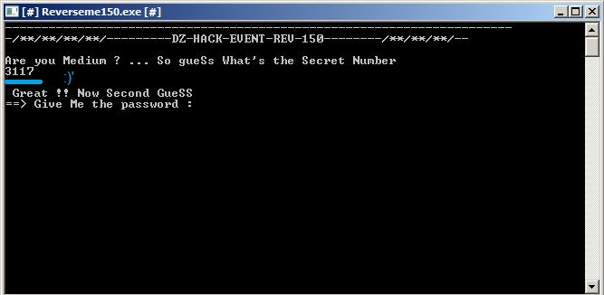
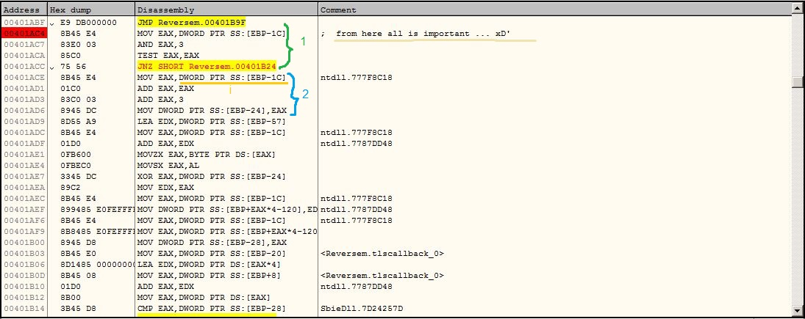
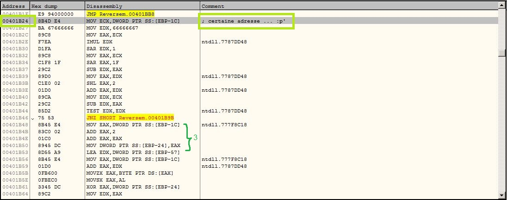
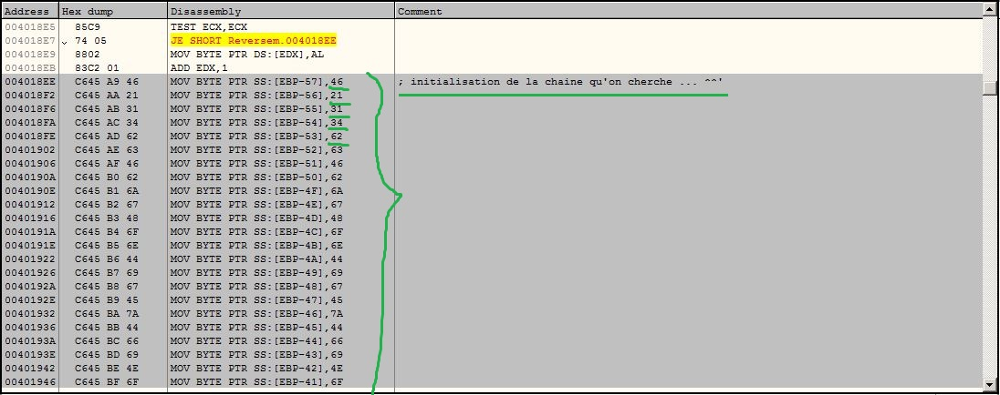

######- Auteur : Mimo-0xC001
######- www.fb.com/0xc00l
######- Category : Reverse
######- Points : 150

-

 > Salam,
 >
 > Voici le lien du binaire : [Reverseme150.exe](./Reverseme150.exe)
 >
 > Pas d'introduction :p',, on va essayé de voir la solution ensemble ^_^'
 >
 > PS: j'ai essayé de simplifié les chose pour que n'importe qui peut comprendre !

-

Tout d'abord on nous a fournie un binaire (exe).
La plus part préfère IDA on ce qui concerne L'Analyse des fichiers binaire etc ... en fait moi aussi,, mais par habitude avec les binaire (exe) je me sens plus à l'aise avec Olly !

Il est pas ci compliqué ne vous inquiéttez pas ;)'

La première chose à faire évidament c'est de testé le binaire,, voila le résultat :

-


-

Emmm ... Ok,, on ouvre le binaire avec Olly ... :

-


-

voila un Strings qui va nous conduire à la première piste ...

PS : Le binaire est pleins d'Anti-Debug,, ça dérange je sais :p' ... on va le detecté peu à peu et puis on va les éliminé (avec un simple patche) ...

-


-

(Pour les patché cliquez sur la fonction résponsable avec la droite,, puis choisissez Assemble finalement cochez "Fill with Nop's" éffacez la commande et cliquez sur Assemble :D' )

Pour le premier code tout est claire,, on a le numéro directe vite fait ...
On peut le tirer facilement depuis la commande à 00401F83  "cmp EAX,0C2D",, il est en Hex "0xC2D" = "3117" ...
Cool,, on essaye le code et Bingo ... à l'étappe suivante : 

-



-

Il nous demande un autre pass :('
On continue ...

-


-

On s'en débarasse d'anti-debug ...

On continue ...

-


-

ici j'ai rencontré une fonction qui n'a pas d'importance,,
pour le 2éme pass le programme lit seulement 19 caractères,, puis il fait une comparaison avec une chaine de 64 caractères ...
c'est évident que la comparaison va retourné toujours faux quelques soit le mot de passe que vous avez entré !

on continue,, juste après ya la fonction qui nous intérèsse :D' ... 

On entre dedans,, on va l'explorer et puis essayer de la comprendre ... :)'

-


-

la fonction commence à 00401FDC,, mais à partir de cette adresse jusqu'à 00401AC4 ya rien d'important ... que des initialisations et tout
(c'est après qu'on aura besoin de cette partie pour avoir une clé utilisé dans le décodage ...)
Donc on saute directement à l'adresse 00401AC4 :

-



-

Ici vous devez vous concentrez un peu ...


on voit bien le premier bout :
          
-        
  ```asm        
   		   MOV EAX,DWORD PTR SS:[EBP-1C]  ; on met le contenu d'une variable dans EAX ( cette variable c'est juste un compteur utilisé dans une boucle )
		   AND EAX,3                      ; c'est claire le AND !  (Rappel : 0 AND 0 = 0 AND 1 = 0 ,, 1 AND 1 = 1 ) 
		   TEST EAX,EAX                   ; en gros,, on vérifie si le compteur est un multiple de 4 ... si ce n'est pas le cas on execute un jump vers une certaine adresse ...
		   JNZ (certaine adresse)
```	
-	
		   
le deuxieme bout :

-  
     ```asm         
		   MOV EAX,DWORD PTR SS:[EBP-1C]  ; je vais appelé DWORD PTR SS:[EBP-1C] le compteur i par la suite   ( MOV EAX,i )
           ADD EAX,EAX                    ; c'est l'équivalent de EAX = EAX * 2
		   ADD EAX,3                      ;  EAX = EAX + 3
		   MOV DWORD PTR SS:[EBP-24],EAX  ; on met le résultat dans une variable ( je vais appelé cette variable "xor_key",, on va voir par la suite pourquoi :p' )
           ....							  ; en gros xor_key = (i*2) + 3
           ....
           ....
 ```	
-	
		  
je vais pas quand même éxpliqué ligne par ligne :p',, mais en gros le rèste c'est de parcourir le mot de passe que vous avez entrez et faire un xor avec la clé obtenu "xor_key"
puis comparer le résultat avec une chaine initialisé dans la partie qu'on a ignorer tout à l'heure ... je vais l'appellé "Key" !

PS : le xor se fait caractère par caractère,, et le "xor_key" se regénère à chaque fois ... !


c'est pas tout,, tout à l'heure j'ai mis "(certaine adresse)" si vous vous souvenez bien :p'
c'est le temps qu'on ailles voir cette certaine adresse xD' (00401B24) 


voila : 

-
          


-

ici on met la valeur du compteur que j'ai appelé i,, dans ECX ... puis on vérifie s'il est multiple de 5 ...


mais si c'est le cas :

-
```asm
			MOV EAX,i 				; claire ...
			ADD EAX,2				; EAX = EAX + 2
			ADD EAX,EAX 			; EAX = EAX * 2
			MOV xor_key,EAX			; xor_key = EAX 
			....					; en gros :  xor_key = (i+2)*2
			....
			....
```
-
		   
le rèste est le même,, on fait un xor blabla ...
le truc c'est que la clé xor_key change,, si i est multiple de 4 on calcule le xor_key avec " xor_key = (i*2) + 3 " ,, sinon si i est multiple de 5 alors " xor_key = (i+2)*2 " ,, sinon on passe à (i+1) ...

Question : quelle est le critère d'arrêt de cette boucle ?! 
Bonne question ;)'
j'ai posé la même question à moi même xD',, c'est la longueur d'une chaine initialisé dans la partie qu'on a ignoré ( la chaine ne sert à rien,, c'est juste sa longueur qui importe ... elle fait 26 caractères) ... :)'

-


-

Il nous manque un dernier truc :O' ... La Clé ( c'est pas la clé xor_key,, mais je parle la chaine qu'on comparre avec après avoir fait le xor ... )
béh,, on peut l'obtenir facilement avec 2 méthode ... la première consiste à prendre les valeur en hex qui sont claire dans Olly et puis de les décodé en text -_-'
perso,, je préfère celle du faire un breakpoint dans la partie initialisation et puis suivre l'execution jusqu'à ce que l'initialisation soit terminer,, vous jettez un coup d'oeil sur le STACK et ooop : 

-



-

Enfin,, voila la chaine : la chaine = "F!14bcFbjgHonDigEzDfiNoshDFR14Gff5zDBEssZerg=="


j'espère que vous avez bien compris le principe,, dans ce cas vous pouvez écrire votre propre script qui va vous fournir le FLAG ^_^'
en tout cas voila le script que j'ai écrit pour avoir le flag ... :)'

-

```python

#!/usr/bin/env python

#SICA 2016 _ RE-150
#Team : Th3Jackers
#Mimo-0xC001
#www.fb.com/0xC00l

def getFlag():
 Key="F!14bcFbjgHonDigEzDfiNoshDFR14Gff5zDBEssZerg=="
 Flag=""
 for i in range(26):
  if(not (i & 3)):
   xor_key=(2*i) + 3
   Flag+= chr(xor_key ^ ord(Key[i]))
  if(not (i % 5)):
   xor_key=2*(i+2)
   Flag+=chr(xor_key ^ ord(Key[i]))
 return Flag

def main():
 print "[+] - Flag : ", getFlag() 
 
if __name__ == '__main__':
    main()

```

-

[Solve-150.py](./Solve-150.py)

je vous remercie d'avoir lit ce write-up,, et j'espère qu'il vous a été utile ^_^'

Salam.
		   
